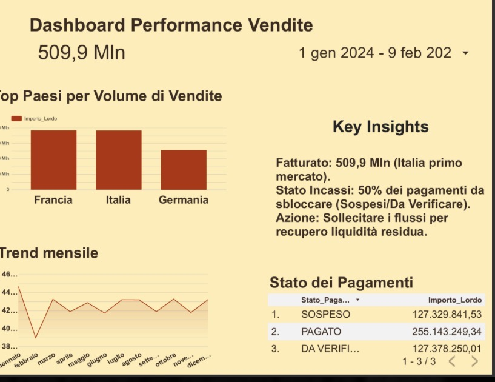

# 💰 $509.9M Revenue Analysis: 2 Million Rows Pipeline
## Big Data Engineering & Financial Insights with Python, SQL & Looker Studio

### 🔗 [Click here to view the Interactive Dashboard](https://lookerstudio.google.com/reporting/f54bf480-5bf1-4ce2-a6ef-a1ced9c3c75d)

---

### 🇬🇧 English
**Project Overview:**
I analyzed a dataset of 2 million rows to understand why a business with **€509M in sales** only collected **€255M**.

**What I found:**
* **The Bug:** It's not a market problem. Italy, France, and Germany all show the same 50% gap. This is a technical software bug in the payment system.
* **The Solution:** By fixing the payment module, the company can recover 50% of its liquidity immediately.
* **Tools:** Python (Processing), BigQuery (Storage), and Looker Studio (Visualization).

👉 **For more details, please check the [Python Script] for the technical logic and the [Business_Strategy_Report.pdf] for the full analysis.**

---

### 🇮🇹 Italiano
**Panoramica del Progetto:**
Ho analizzato un dataset da 2 milioni di righe per capire perché un'azienda con **509 milioni di euro di vendite** ne ha incassati solo **255 milioni**.

**Cosa ho scoperto:**
* **Il Bug:** Non è un problema di mercato. Italia, Francia e Germania hanno tutte lo stesso "buco" del 50%. Si tratta di un errore tecnico nel sistema di pagamento.
* **La Soluzione:** Riparando il sistema, l'azienda può recuperare il 50% della liquidità immediatamente, senza spendere un euro in pubblicità.
* **Strumenti:** Python (Elaborazione), BigQuery (Gestione dati) e Looker Studio (Report finale).

👉 **Per maggiori informazioni, controlla il file [Python Script] per la logica tecnica e il [Business_Strategy_Report.pdf] per l'analisi completa.**

---

### 🇫🇷 Français
**Aperçu du Projet :**
J'ai analysé un jeu de données de 2 millions de lignes pour comprendre pourquoi une entreprise avec **509 M€ de ventes** n'en a collecté que **255 M€**.

**Ce que j'ai trouvé :**
* **Le Bug :** Ce n'est pas un problème de marché. La France, l'Italie et l'Allemagne présentent toutes le même écart de 50 %. Il s'agit d'un bug technique du système de paiement.
* **La Solution :** En réparant le module de paiement, l'entreprise peut récupérer 50 % de ses liquidités immédiatement.
* **Outils utilisés :** Python (Traitement), BigQuery (Stockage) et Looker Studio (Tableau de bord).

👉 **Pour plus de détails, veuillez consulter le [Python Script] pour la logique technique et le [Business_Strategy_Report.pdf] pour l'analyse stratégique.**

---

### 📁 Project Files
* 🐍 `Python Script`: Full technical processing of 2M+ rows.
* 📊 `Business_Strategy_Report.pdf`: Strategic financial recovery plan.
* 🖼️ `IMG_4784.jpg`: Dashboard preview.
